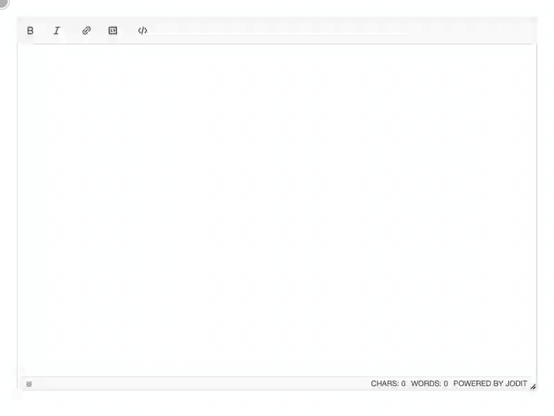

# Code block

[](https://www.npmjs.com/package/jodit-plugin-code)
[](https://www.npmjs.com/package/jodit-plugin-code)
[](https://www.jsdelivr.com/package/npm/jodit-plugin-code)

`jodit-plugin-code` inserts code blocks with syntax highlighting: choose a language, paste the code, check the preview and insert.



- **Highlighting** by [highlight.js](https://highlightjs.org/) with 36 common languages included, automatic detection, and any other language on request.
- **Preview** on its own tab of the dialog, exactly as the block will look.
- **Line numbers** as an option, left out when the code is selected or copied.
- **Download as a file**: a block can offer its code as a file, named by you or `Untitled.<ext>`.
- **Looks right everywhere**: every part of the block has inline styles, so it needs no CSS on the site, in an email or in a CMS.
- **Customizable**: the colors are CSS variables and every part has a `jodit-code__*` class.
- **Copy and download buttons** in the header of the block: in the editor, and on the site from a 2 KB runtime script.
- **Editing**: double-click a block, or click it and use its toolbar to change the language, switch line numbers, edit, copy or delete it. Plain `<pre>` blocks become highlighted blocks when edited.
- **Translations**: English, German and Russian.

## Try it

Press the code button, choose a language, paste some code, look at the "Preview" tab and press "Insert". Then click the block to change its language or switch line numbers, or double-click it to edit the code.

``` { .js .jodit-demo }
Jodit.make('#editor', {
	buttons: ['bold', 'italic', '|', 'code', '|', 'source']
});
```

## Quick start

```shell
npm install jodit jodit-plugin-code
```

```js
import { Jodit } from 'jodit';
import 'jodit/es2021/jodit.min.css';
import 'jodit-plugin-code';

Jodit.make('#editor');
```

On the pages that show the content, add the [runtime](runtime.md) for the copy button. Other ways to connect the plugin are in [Installation](installation.md); the look of the block is described in [Styling](styling.md).
