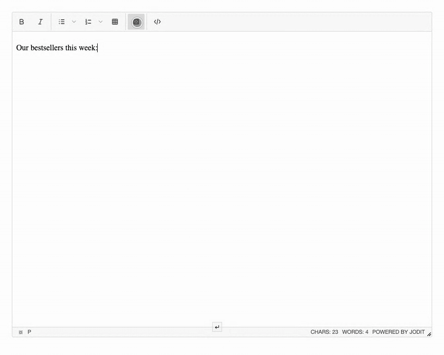

# Data generation

[](https://www.npmjs.com/package/jodit-plugin-datagen)
[](https://www.npmjs.com/package/jodit-plugin-datagen)
[](https://www.jsdelivr.com/package/npm/jodit-plugin-datagen)

`jodit-plugin-datagen` fills the editor with realistic sample content: posts, quotes, comments, to-do lists, people, products, reviews, recipes, an order with totals, and placeholder images. The data comes from [DummyJSON](https://dummyjson.com/), and the HTML from a ready layout or from your own template.



- **Ten types of data**: posts, quotes, comments, to-dos, users, products, reviews, recipes, an order and placeholder images. See [Types of data](types.md) for every field.
- **Ready layouts**: headings with paragraphs, lists, checklists, tables, cards, full recipes and more, two to four for each type.
- **Your own template**: HTML before the items, for every item and after them, with placeholders like `{{title}}` and filters like `{{tags|ul}}`, highlighted as you type. See [Templates](templates.md).
- **Up to 100 items at once**, chosen at random without repeats; "Shuffle" picks others.
- **Preview before inserting**: exactly what the preview shows goes into the editor.
- **Mistakes are caught**: an unknown field or filter is underlined in the template and stops the insertion; a tag that is not closed is a warning.
- **Safe**: the values are escaped, the preview runs no scripts, and the inserted HTML is cleaned by the editor like any other insertion.
- **Plain content**: the inserted HTML has no marks of the plugin and is not tied to it.
- **Remembers your choice**: the type, the number, the layouts and your templates, in the browser.
- **Translations**: English, German and Russian.
- No dependencies.

## Try it

Press the button with the dice in the toolbar, choose the type (a line under the choice says what it holds), the number and the layout, look at the preview and press "Insert". The "Template" tab shows the template of the layout and the fields you can use; the "Help" tab has a short reference. The demo asks dummyjson.com for the data.

``` { .js .jodit-demo }
Jodit.make('#editor', {
	buttons: ['bold', 'italic', '|', 'ul', 'ol', 'table', '|', 'datagen', '|', 'source'],
	height: 400
});
```

## Quick start

```shell
npm install jodit jodit-plugin-datagen
```

```js
import { Jodit } from 'jodit';
import 'jodit/es2021/jodit.min.css';
import 'jodit-plugin-datagen';

Jodit.make('#editor');
```

The "Generate data" button appears in the toolbar of every editor. See [Installation](installation.md) for the CDN and `extraPlugins`, [Options](options.md) for the types, the number and the layouts of your site, and [Templates](templates.md) to write your own.

## Inserted content is final

The plugin inserts regular HTML. It leaves no attributes or wrappers of its own in the content, so the saved text stays clean, and so an inserted block cannot be opened in the dialog again or generated anew. Check the preview before pressing "Insert"; the editor's undo removes an insertion.

## Network and privacy

The data is loaded from the browser of the person who edits the text: one request for each type, with the fields the plugin needs, kept for the rest of the page. Nothing from the editor is sent. The private fields of the users of DummyJSON (passwords, card numbers and the like) are never asked for.

Images, avatars and the pictures of products and recipes stay links to `dummyjson.com` and `cdn.dummyjson.com`. They are meant for drafts, mock-ups and demos: if the service is not available, these images will not show. To load the data from your own servers, run your own copy of DummyJSON and set [`baseUrl`](options.md#your-own-data-service); placeholder images then come from your copy too, while avatars and the pictures of products and recipes are where its data says.
