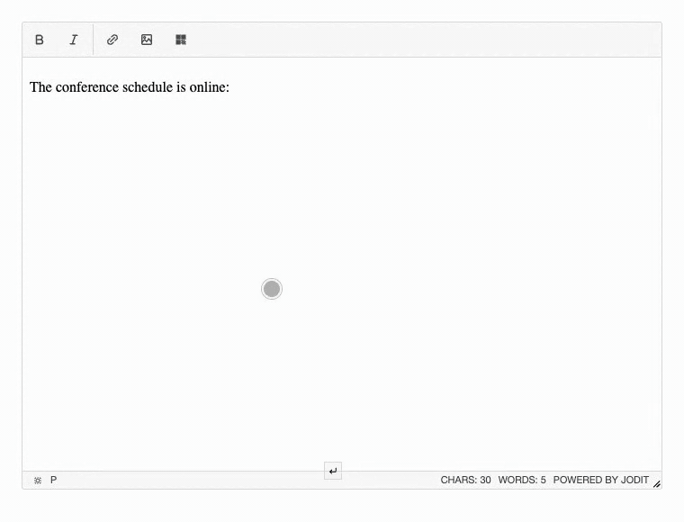

# QR code

[](https://www.npmjs.com/package/jodit-plugin-qrcode)
[](https://www.npmjs.com/package/jodit-plugin-qrcode)
[](https://www.jsdelivr.com/package/npm/jodit-plugin-qrcode)

`jodit-plugin-qrcode` adds a toolbar button that turns any text or link into a QR code and inserts it as an image.



- **Live preview**: the code is redrawn while you type.
- **Selection as input**: select a link in the text and press the button, the dialog opens with it; the text stays and the code is inserted right after it.
- **Editing**: double-click an inserted code, or click it and press the button, to change its text; the image is updated in place and keeps its size.
- **Works with the image tools**: resizing and alignment work as for any image; the image properties dialog is not opened for QR codes.
- **No server needed**: the image is generated in the browser and inserted as a `data:` URL (PNG or SVG).
- **Translations**: English, German and Russian; follows the editor `language` option.

The QR codes are generated by the [qrcode](https://www.npmjs.com/package/qrcode) library. It is installed together with the plugin and is already included in the browser build.

## Try it

Press the QR code button in the toolbar, type a text or link and press "Insert". You can also type a link in the editor, select it and then press the button: the dialog opens with the selected text. Double-click the inserted code to change it; insert a regular picture with the image button to compare.

``` { .js .jodit-demo }
Jodit.make('#editor', {
	buttons: ['bold', 'italic', '|', 'link', 'image', 'qrcode', '|', 'source']
});
```

## Quick start

```shell
npm install jodit jodit-plugin-qrcode
```

```js
import { Jodit } from 'jodit';
import 'jodit/es2021/jodit.min.css';
import 'jodit-plugin-qrcode';

Jodit.make('#editor');
```

Other ways to connect the plugin, including a CDN `<script>` tag and `extraPlugins`, are described in [Installation](installation.md). Settings are listed in [Options](options.md).
