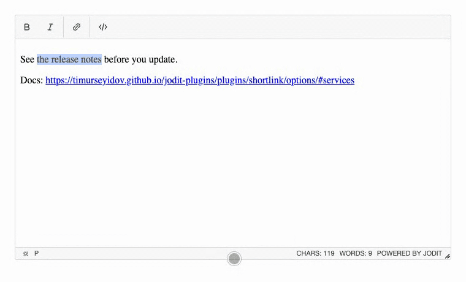

# Short links

[](https://www.npmjs.com/package/jodit-plugin-shortlink)
[](https://www.npmjs.com/package/jodit-plugin-shortlink)
[](https://www.jsdelivr.com/package/npm/jodit-plugin-shortlink)

`jodit-plugin-shortlink` turns long links into short ones with a link shortening service, right where links are made: in the link form and in the toolbar of an existing link.



- **In the link form**: a "Shorten" button next to the URL field replaces the URL with the short link. Check it, then press "Insert" as usual.
- **On an existing link**: click the link, and the "Shorten link" button in its toolbar changes it in place.
- **The text follows the link**: when the text of a link is its URL, it becomes the short link too; other text stays.
- **Services**: [da.gd](https://da.gd/) and [clck.ru](https://clck.ru/) to choose from, or your own service as a function.
- **Choice right there**: a list next to the "Shorten" button in the form and an arrow on the button in the link toolbar; the choice is remembered in the browser.
- **Clear errors**: the message of the service, or why the request failed (no connection, no answer in time, not an http(s) link), in the language of the editor.
- **No toolbar button of its own**: the plugin adds to the link UI of Jodit and gets along with the [email link](../mailto/index.md) plugin.
- **Translations**: English, German and Russian.
- No dependencies, about 10 KB minified.

## Try it

Select some text, press the link button, paste a long URL and press "Shorten". Or click the link in the editor and press the "Shorten link" button in its toolbar; its arrow chooses the service. The demo makes real requests to da.gd and clck.ru.

``` { .js .jodit-demo }
const editor = Jodit.make('#editor', {
	buttons: ['bold', 'italic', '|', 'link', '|', 'source']
});

editor.value =
	'<p>Docs: <a href="https://timurseyidov.github.io/jodit-plugins/plugins/shortlink/options/">https://timurseyidov.github.io/jodit-plugins/plugins/shortlink/options/</a></p>';
```

## Quick start

```shell
npm install jodit jodit-plugin-shortlink
```

```js
import { Jodit } from 'jodit';
import 'jodit/es2021/jodit.min.css';
import 'jodit-plugin-shortlink';

Jodit.make('#editor');
```

The buttons appear in the link form and the link toolbar of every editor. See [Installation](installation.md) for the CDN and `extraPlugins`, and [Options](options.md) to choose the service.

## Privacy

To make a short link, the plugin sends the long URL to the chosen service, from the browser of the person who edits the text. Choose a service that your privacy policy allows, or run your own and pass it as a [function](options.md#your-own-service).
